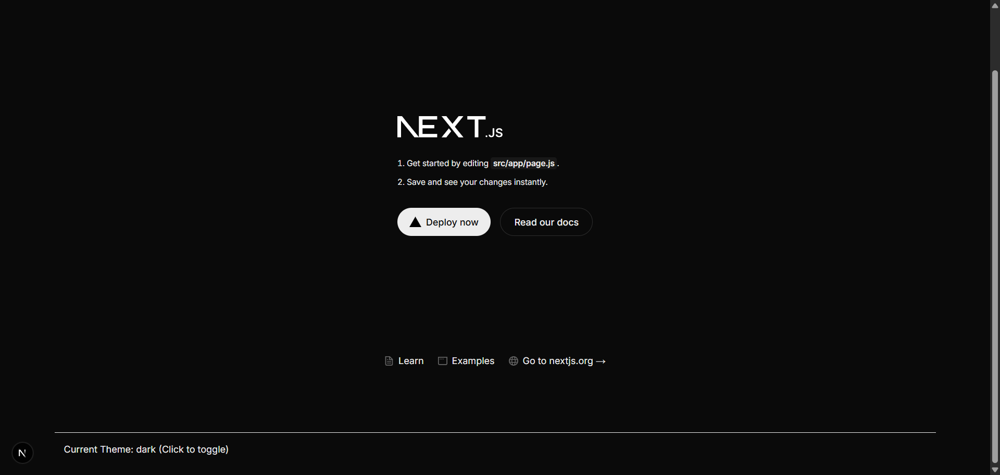
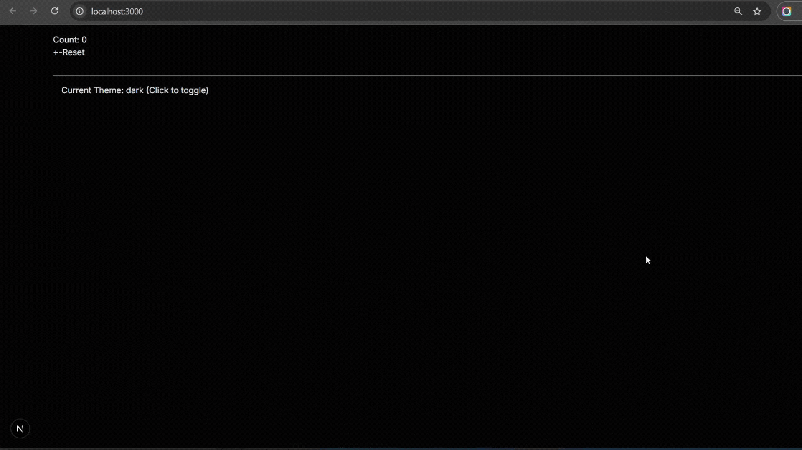
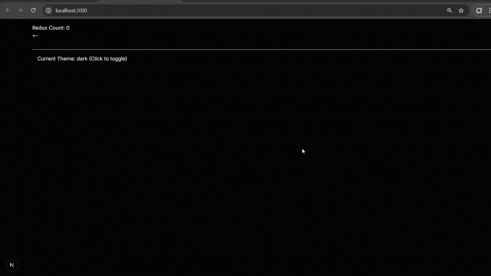
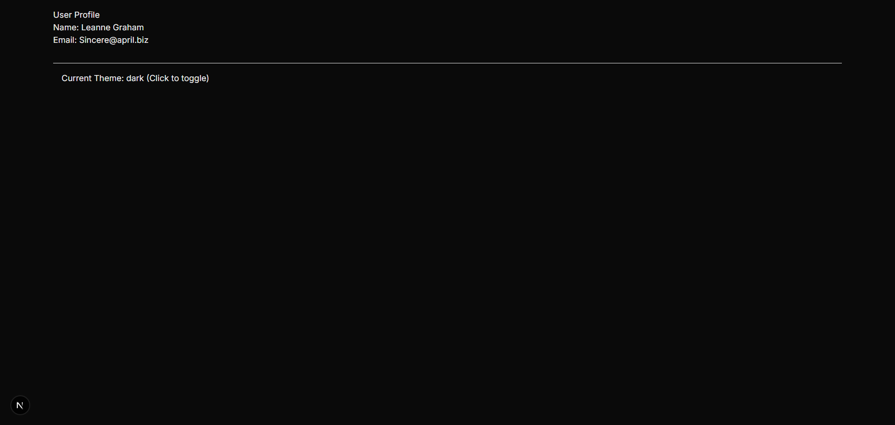
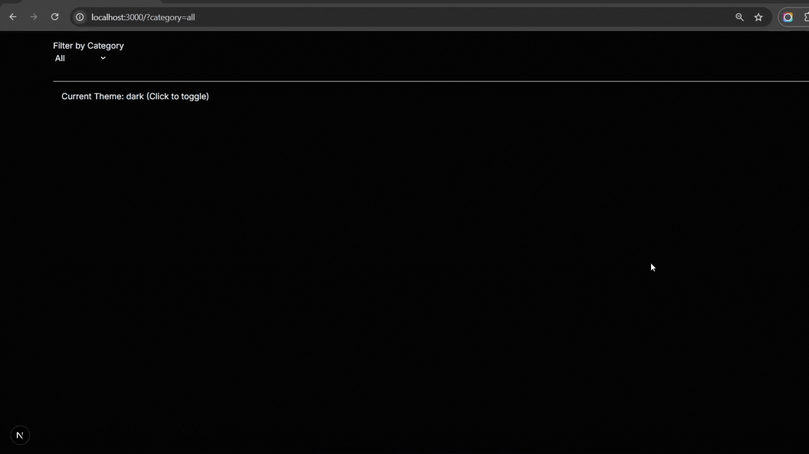

This is a [Next.js](https://nextjs.org) project bootstrapped with [`create-next-app`](https://github.com/vercel/next.js/tree/canary/packages/create-next-app).

## Getting Started

First, run the development server:

```bash
npm run dev
# or
yarn dev
# or
pnpm dev
# or
bun dev
```

Open [http://localhost:3000](http://localhost:3000) with your browser to see the result.

You can start editing the page by modifying `app/page.js`. The page auto-updates as you edit the file.

This project uses [`next/font`](https://nextjs.org/docs/app/building-your-application/optimizing/fonts) to automatically optimize and load [Geist](https://vercel.com/font), a new font family for Vercel.

## Learn More

To learn more about Next.js, take a look at the following resources:

- [Next.js Documentation](https://nextjs.org/docs) - learn about Next.js features and API.
- [Learn Next.js](https://nextjs.org/learn) - an interactive Next.js tutorial.

You can check out [the Next.js GitHub repository](https://github.com/vercel/next.js) - your feedback and contributions are welcome!

## Deploy on Vercel

The easiest way to deploy your Next.js app is to use the [Vercel Platform](https://vercel.com/new?utm_medium=default-template&filter=next.js&utm_source=create-next-app&utm_campaign=create-next-app-readme) from the creators of Next.js.

Check out our [Next.js deployment documentation](https://nextjs.org/docs/app/building-your-application/deploying) for more details.

## Laporan Praktikum

|  | Pemrograman Berbasis Framework 2025 |
|--|--|
| NIM |  2241720083 |
| Nama |  Ahmed Fathir Syafaat |
| Kelas | TI - 3C |

### Praktikum 1


### Praktikum 2


### Praktikum 3


### Praktikum 4


### Praktikum 5


### Tugas
1. Bandingkan performa antara Context API, Zustand, dan Redux

| Kriteria         | Context API                         | Zustand                         | Redux Toolkit                        |
|------------------|--------------------------------------|----------------------------------|--------------------------------------|
| Kompleksitas     | Rendah                               | Medium                           | Tinggi                               |
| Performa         | Rendah (mudah terjadi over-render)    | Tinggi (minim re-render)          | Medium (lebih berat dari Zustand)    |
| SSR Support      | Manual (perlu setup sendiri)          | Auto (lebih mudah integrasi)      | Menggunakan `next-redux-wrapper`     |
| Learning Curve   | Rendah                               | Rendah                           | Tinggi (harus paham action, reducer, store) |
| Ukuran Bundle    | 0 KB (native React)                  | ~1 KB                            | 10 KB+                               |

Jadi, Context API cocok untuk state sederhana dan jarang berubah, lalu Zustand lebih optimal untuk state kompleks yang sering berubah, dengan performa tinggi dan setup ringan, dan Redux Toolkit kuat untuk proyek besar dan kompleks, terutama kalau butuh debugging dan kontrol penuh.

2. Diskusikan kapan sebaiknya menggunakan masing-masing solusi
> Context API:
> - Untuk state sederhana, jarang berubah. Contohnya theme, auth.
> - Proyek kecil sampai menengah yang tidak membutuhkan optimasi performa tinggi.

> Zustand:
> - Untuk state kompleks atau sering berubah.
> - Saat ingin solusi ringan, cepat setup, dan performa tinggi.
> - Cocok untuk dashboard, cart management, dll. 

> Redux Toolkit:
> - Untuk aplikasi skala besar dan kompleks.
> - Ketika butuh devtools kuat, time travel debugging.
> - Butuh kontrol penuh terhadap flow state seperti actions, reducers, middleware.